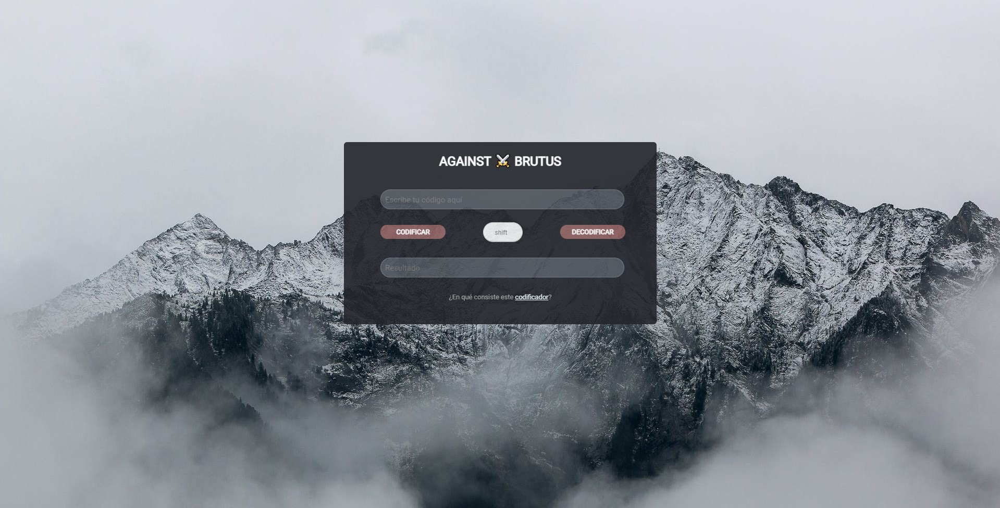
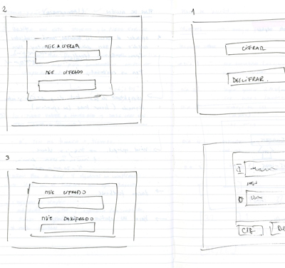
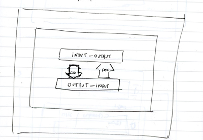
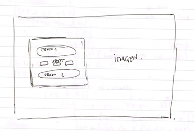

# Against Brutus

## Índice

* [Cesar Cipher](#caesar-cipher)
* [Sobre Against Brutus](#sobre-against-brutus)
* [Instrucciones de uso](#instrucciones-de-uso)
* [Interfaz](#interfaz)
* [Sobre el diseño](#sobre-el-diseño)
* [Prototipos](#prototipos)
* [Objetivos de aprendizaje pendientes](#objetivos-de-aprendizaje-pendientes)
* [Enlace](#enlace)

***

## Caesar Cipher

Cifrar significa codificar. El [cifrado César](https://en.wikipedia.org/wiki/Caesar_cipher)
es uno de los primeros métodos de cifrado conocidos. El emperador romano Julio
César lo usaba para enviar órdenes secretas a sus generales en los campos de
batalla.

El cifrado césar es una de las técnicas más simples para cifrar un mensaje. Es
un tipo de cifrado por sustitución, es decir que cada letra del texto original
es reemplazada por otra que se encuentra un número fijo de posiciones
(desplazamiento) más adelante en el mismo alfabeto.

***

## Sobre Against Brutus

**¿Compartes tu contraseña de Netflix con tu familia y/o amigos y tienes miedo de que alguien te la robe?**

Against Brutus (*"En contra de Brutus"*, el traidor del César) es una plataforma web de encriptación que ayuda a generar un poco más de seguridad a las contraseñas para que estas puedan ser compartidas con amigos y familia. Solo se necesita acordar un número de desplazamiento en particular (shift) para así ambos poder codificar y decodificar el texto.
 
La idea surge debido a la práctica común de compartir, por ejemplo, *passwords* de plataformas como Netflix, Amazon Prime, o incluso del mismo correo personal. Sin embargo, suele existir un miedo a que estas sean interceptadas por las redes y sean robadas. Así, Against Brutus aparece como una forma de dificultar tal situación y evitar pequeñas brechas de seguridad.

Against Brutus permite codificar:
* mayúsculas
* minúsculas
* números

## Instrucciones de uso
**Para codificar**
* Escribe la contraseña que deseas encriptar en la primera caja que dice "escribe tu código aquí".
* En shift, elige tu número de desplazamiento de acuerdo con lo acordado con tus amigos o familia. Puede ser un número positivo o negativo. ¡Y de forma infinita!
* Hazle clic a **codificar**
* Tu contraseña encriptada se mostrará en la caja de resultado.

**Para decodificar**
* Escribe la contraseña que te entregaron ya encriptada en la primera caja que dice "escribe tu código aquí".
* En shift, elige tu número de desplazamiento de acuerdo con lo acordado con tus amigos o familia. Puede ser un número positivo o negativo. ¡Y de forma infinita!
* Hazle clic a **decodificar**
* Tu contraseña descifrada se mostrará en la caja de resultado.

## Interfaz

***
## Sobre el diseño

Considerando que el público objetivo consiste en quien desee únicamente encriptar y descifrar una password, la plataforma debiera ser simple, minimalista, pero agradable a la vista. 
Los cuadros de texto son pequeñas debido a lo mismo, pues no se planea codificar un mensaje largo, sino tan solo alguna contraseña, las que normalmente no poseen más de 15 caracteres.
Se agrega también un link que dirige a una explicación simple sobre la función de la página.

## Prototipos

Los prototipos fueron varios, pero tomó poco tiempo desarrollarlos. El diseño final, si bien no igual, mantiene la esencia y los aspectos fundamentales de la idea original.

 Clic para ver prototipos 

> 

> 

> 

 

***

## Objetivos de aprendizaje del proyecto anterior

Aquellos objetivos pendientes del proceso de preadmisión que se lograron con este proyecto:

> Aprender un poco más de:
> * [x] Functions. 
> * [x] Arrays. 
> * [x] Objects.
 
 

## Enlace

https://nikoguerrero.github.io/SCL017-cipher/